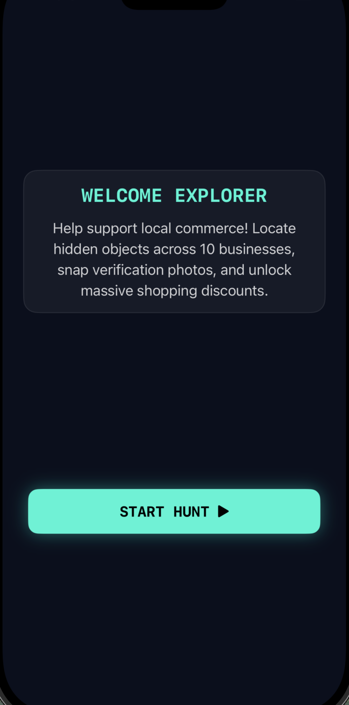
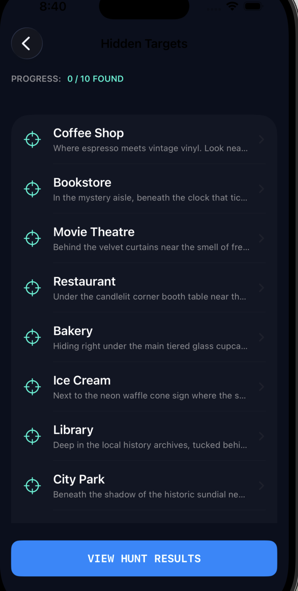
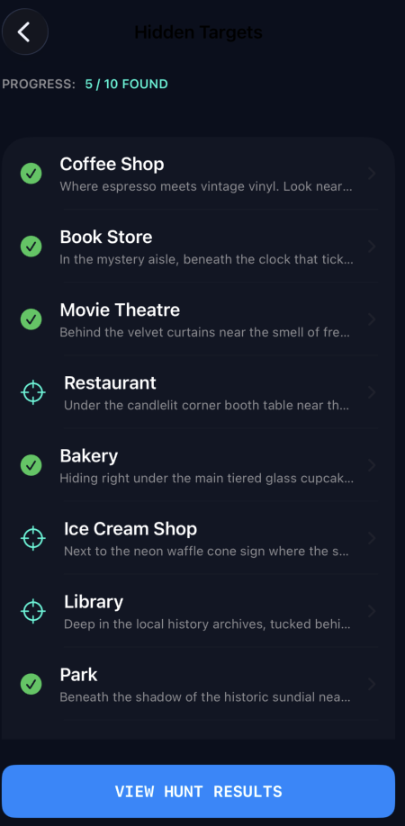
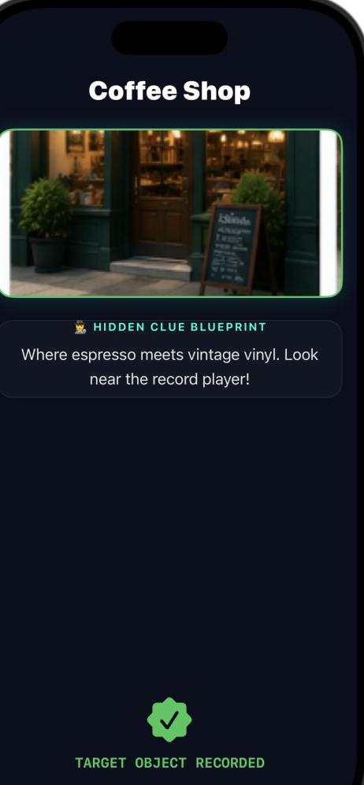
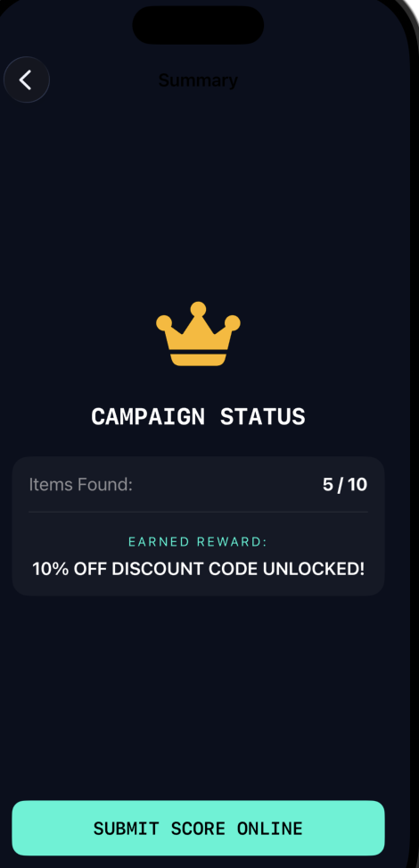

# Scavenger Hunt App 

Course Code: MWD3A (iOS Development)  
Assignment: Assignment 3 – Scaffolding Core Features  
Platform:  iOS 17+ (SwiftUI)

#  Project Overview

Developed for the local Chamber of Commerce, this Scavenger Hunt application is designed to promote local businesses (restaurants, movie theatres, bookstores, etc.) by engaging residents in an interactive city-wide hunt. The app highlights 10 hidden items across various venues, offering clues to guide participants. 

Using concepts explored in the *Cards* tutorial—including complex view hierarchies, dynamic state management, data iteration, and asset rendering—the app implements an interactive camera simulation to track progress and dynamically awards tier-based commercial discounts based on performance.

# Project  Structure

ScavengerHunt/
├── ScavengerHuntApp.swift      # Application Entry point & Main Environment Provider
├── ContentView.swift           # Main Application View Root Gatekeeper
├── Models/
│   ├── HuntItem.swift          # Core Architectural Data Structure Model
│   └── RewardManager.swift     # Centralized State and Rule Business Engine
├── Resources/
│   └── HuntData.swift          # Static Clue Inventory Repository Setup
├── Views/
│   ├── SplashView.swift        # Initial Animated Timing Screen Sequence
│   ├── HomeView.swift          # Onboarding Welcome Dashboard Component
│   ├── ClueListView.swift      # Interactive Master Checkpoint Roster Layout
│   ├── DetailView.swift        # Expanded Clue Inspection & Image Capture View
│   └── ResultsView.swift       # Final Campaign Status Metrics Summary Recapitulation
└── Utils/
    └── Utils.swift             # Hexadecimal Color Hex Initializers & Helpers

#  Features

* Dynamic Animation Splash Sequence: Implements smooth `withAnimation` breathing cycles on structural vector elements before handling automated background routing handoffs.
* Modern Navigation Stack Architecture: Powered entirely by the modern `NavigationStack` and type-safe data-driven `.navigationDestination(isPresented:)` modifiers to avoid layout deprecation warmings.
* Centralized Reactive State Management: Leverages Combine's `@StateObject` and `@EnvironmentObject` pipelines to synchronize progress across 5 decoupled view layouts seamlessly.
* Tiered Reward System Engine: Automatically processes user milestones in real time to calculate and distribute custom business coupons up to a grand prize draw entry threshold.
* High-Contrast Cyber Theme:  Styled beautifully using a customized glassmorphic design palette with glowing neon accents (`#00F5D4`), dark mode optimizations, and clean monospace typography layouts.

🛠 Business Rules & Reward Tiers

The RewardManager automatically evaluates structural item completion states and matches current scores against the Chamber of Commerce parameters:
     
     Items Found      Unlocked Reward Status Message
     
     0 – 4 Items      FIND X MORE ITEMS TO UNLOCK DISCOUNTS!
     5 – 6 Items      10% OFF DISCOUNT CODE UNLOCKED!
     7 – 9 Items      20% OFF DISCOUNT CODE UNLOCKED!
     10 Items         20% OFF CODE + $5,000 GRAND PRIZE DRAW ENTRY!

### Splash Screen

### Home Page

### Clue List Screen

### Selected Target Screen

### Target Detail Screen

### Reward Screen

+-------------------+
|    Splash Screen  |
|                   |
|  Scavenger Hunt   |
|                   |
+---------+---------+
          |
          v

+-------------------+
|    Home Screen    |
|                   |
| Start Hunt Button |
|                   |
+---------+---------+
          |
          v

+-------------------+
|   Clue List View  |
|                   |
| Clue 1            |
| Clue 2            |
| Clue 3            |
| ...               |
+---------+---------+
          |
          v

+-------------------+
|   Detail Screen   |
|                   |
| Clue Information  |
|                   |
| Take Picture      |
+---------+---------+
          |
          v

+-------------------+
|   Results Screen  |
|                   |
| Items Found: 7    |
| Reward: 20% Off   |
+-------------------+

Scavenger Hunt App

Screen 1:
SplashView
- App title
- Logo
- Auto navigate to HomeView

Screen 2:
HomeView
- Welcome message
- Start Hunt button

Screen 3:
ClueListView
- List of 10 clues
- Select clue

Screen 4:
DetailView
- Show clue details
- Take Picture button

Screen 5:
ResultsView
- Display items found
- Display reward
